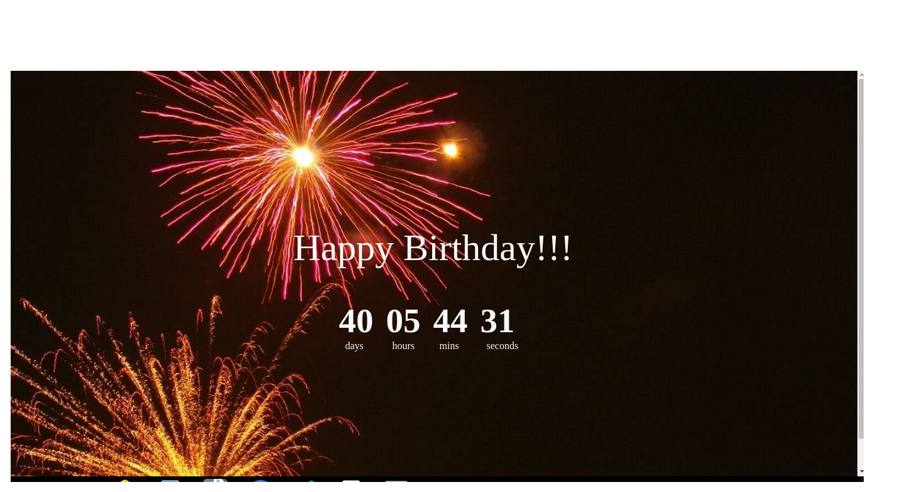

<p align="center">
  
</p>
<h1 align='center'>🚀A Countdown  🚀 </h1>
A simple countdown to show  how much time is left for a date, when the date expires, it is automatically changed to the next year.
<h2>Layout</h2>
  
<h2>How to run this repo: 🚀</h2>

```bash

# Clone this repositório
$ git clone git@github.com:SMarkus27/Birthday-Countdown.git

# Open the project folder in the terminal/cmd
$ cd Birthday-Countdown

# Run the index file in your browser:
$ index.html


```

<h2>Tech Stack</h2>
<ul>
  <li>HTML5</li>
  <li>CSS3</li>
  <li>JavaScript</li>
</ul>
 📝 License

This project is under license [MIT](./LICENSE).

Made by Marcus Vinicius 👋🏽 [Get in touch!](https://www.linkedin.com/in/marcus-vinicius-campos=pereira)
